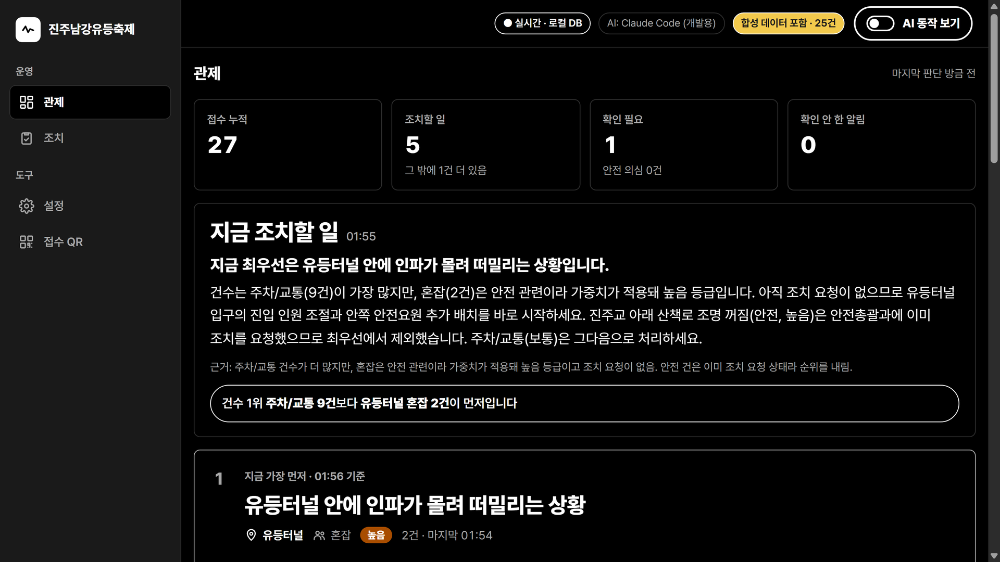

# 개발완료보고서 (별지 4)

<!-- 숫자 옆 주석은 근거 파일 경로입니다. 제출본에서는 빠집니다(제출_준비/최종/_build_docs.py). 분량: 표지 제외 A4 5쪽 이내, 본문 10.5pt. -->

**실시간 축제 민원 관제 AI Agent**
철철철 · 대학부 · 지정분야 ⑤ 경남 지역혁신·공공서비스 AI Agent

---

## 1. 프로젝트 현황

| 항목 | 내용 |
|---|---|
| 요약 | 방문객이 QR로 남긴 민원을 AI 에이전트가 분류하고 심각도로 순위를 매겨, 운영자에게 "지금 조치할 일"과 담당 부서 조치요청서를 만들어 준다. 대상: 진주남강유등축제 |
| 팀 | 철철철 — 강은진(대표) · 김동우, 인제대학교 |
| 역할 | 강은진·김동우 2인 공동 개발(설계·개발·시험 공동) |
| 기간 · 완성도 | 2026-09-29 ~ 10-06 · Level 3 (MVP), 접수부터 조치요청서·브리핑까지 한 흐름 동작 |
| 저장소 | https://github.com/INJE-NULLPOINT/festival-complaint-agent (공개 저장소) |

## 2. 프로젝트 개요

### 2.1 문제와 사용자

축제에는 불편 민원(주차·가격·화장실)이 많고 안전 민원(어두운 길·난간·인파 밀림)은 적게 들어온다. 건수 순으로 보면 안전 민원이 뒤로 밀린다. 국민신문고는 처리기간이 일반적으로 7~14일이라<!-- 제출_준비/비즈니스모델.md [17] --> 3~10일짜리 축제 안에 현장 조치로 이어지기 어렵다.

사용자는 축제 운영 담당 주무관(관제·조치 화면)과 현장 운영요원(조치 상태 변경)이다. 방문객은 이름·연락처 없이 QR로 접수한다.

### 2.2 목표와 성공지표

| 목표 | 지표 | 현재 결과 |
|---|---|---|
| 안전 민원이 묻히지 않음 | 합성 시드에서 심각도 1위가 안전 | 안전 11건 '높음'(79.9점) 1위, 건수 1위 주차 54건은 '보통'(57.2점)<!-- README.md '실시간으로 보기', 규칙 분류 --> |
| 가중치를 바꿔도 결론 유지 | 가중치 ±20% 81개 조합 | 81/81 안전 1위 유지<!-- tests/sensitivity_report.md --> |
| 분류 정확도 | 합성 32건 | 96.9%(31/32), 95% CI 84.3~99.4%, 안전 재현율 4/4<!-- tests/accuracy_report.md --> |
| 접수 후 10초 이내 분류 | 20회 이상, 중앙값·p90 ≤ 10초 | 5회 측정 중앙값 7.5초 · p90 11.3초, 표본 부족으로 미판정<!-- tests/wall_clock_report.md --> |
| 대표 Test Case | 5건 통과 | 5/5<!-- tests/testcase_report.md --> |

## 3. 개발 세부 내용

### 3.1 시스템 구조

```
[QR 접수] → feedback_inbox → 워커(마스킹·저장, 원문 삭제)
  Fast Path : ①분류 → 관제 유입
  Agent Path: ⓪계획 → ②감시(심각도 함수) → ③조치(DOCX) → ④통합(카드·브리핑)
[운영자 조치 상태] → 다음 주기 판정에 반영
```

판단이 도는 동안에도 접수·분류는 멈추지 않는다. 웹은 Vite + TypeScript, 데이터는 Supabase(시험은 SQLite), 서버는 TypeScript(Node 24)이며 에이전트 루프·작업 큐는 프레임워크 없이 직접 구현했다.

### 3.2 AI 에이전트와 도구

모델: Claude Opus 5.5(`claude-opus-5-5`), Claude Code CLI(`claude -p`) 경유.

| 에이전트 | 역할 | 주요 도구 |
|---|---|---|
| ⓪ 계획 | 이번 주기의 단계·집계 창 결정 | plan_cycle |
| ① 분류 | 유형·감정·안전 여부, 과거 사례 참고 | save_classification, lookup_similar |
| ② 감시 | 심각도 함수 호출, 알림 | get_window_stats, score_label, raise_alert, save_snapshot |
| ③ 조치 | 담당 부서 조치요청서 | write_request, get_department, collect_quotes, generate_doc, lookup_festival_info |
| ④ 통합 | 우선순위·관제 카드·브리핑 | rank_issues, rank_actions, write_briefing, read_agent_results |

**판단은 에이전트, 계산은 함수.** 심각도 점수는 LLM이 아니라 `server/core/severity.ts`의 결정적 함수가 계산식과 함께 낸다.

| 규칙 | 내용 |
|---|---|
| S-01 | 기본점수 = 창 안 빈도 60% + 부정 강도 40% |
| S-02 | 안전 ×2.0 (혼잡은 밀림·압사 등 위험 신호가 있을 때만 안전) |
| S-03 | 급증 ×1.5 (최근 15분 유입률 ≥ 직전 60분 평균 × 2) |
| S-04 | 같은 구역 1시간 안전 3건 이상 '즉시'. 생명위험어(압사·쓰러짐·화재 등)는 1건이어도 '즉시' |
| S-05 | 긍정 민원 제외 |
| S-06 | 미조치 30분 ×1.2 |

가중치·문턱값은 설계값이며 행정안전부「지역축제장 안전관리 매뉴얼(2024)」·「다중운집인파사고 안전관리 가이드라인」(2024), 「민원 처리에 관한 법률 시행령」 제19조와 대조했다. 경계 규칙 B-01~B-04로 한가한 시간에 1건이 '즉시'로 튀는 것을 막는다.

### 3.3 기억·피드백·안전

- **기억**: 비슷한 과거 민원을 분류에 참고하고, 운영자가 정한 유형을 먼저 쓴다. 기호·공백만 다른 같은 글이고 위험·지시문·개인정보 신호가 없을 때만 모델 없이 과거 판정을 쓴다.
- **피드백**: 신뢰도 0.3 미만은 '확인 필요'로 넘기고, 운영자가 정한 유형은 다음 분류의 기억이 된다. 조치 상태는 S-06으로 다음 판정에 반영된다.
- **안전**: 연락처·이메일·주민번호·카드번호·차량번호는 저장 전에 가리고 접수 원문은 바로 지운다. "이전 지시 무시" 같은 문장을 탐지하고, 대피·통제·재난문자는 AI가 제안만 한다.

### 3.4 활용 데이터

| 데이터 | 내용 |
|---|---|
| 개발용 시드 | 160건(`seed/dev_sample.csv`), 팀이 만든 합성 문장. 실제 리뷰는 수집하지 않음 |
| 축제 정보 | 기간·장소·주최 수기 입력 (TourAPI 미사용) |
| 부서 매핑 | 유형 → 담당 부서, 설정 데이터 |
| 공개 112 녹취 | 이태원 참사 당일 11건(18:34~22:11), 재현 시험용 |

### 3.5 단계별 개발 내용

| 일차 | 내용 |
|---|---|
| D1 | 문제 정의, 화면 3종, DB, 에이전트 루프, 심각도 함수·단위 테스트 |
| D2~D3 | 접수 파이프라인, ①분류·②감시 에이전트, 마스킹, 알림, Test Case 5종 |
| D4 | ③조치(DOCX)·④통합(브리핑), 리플레이, 접수~브리핑 한 흐름 완성 |
| D5 | 경계 규칙, '확인 필요', 도배 방지, 연결 끊김 대응, 웹 + Supabase·서버 TypeScript 전환, ⓪계획 |
| D6 | 실제 모델 Test Case, 정확도·지연·공격 점검, 가중치 민감도, 이태원 재현 |
| D7~D8 | 회귀 검사, 제출물 정리 |

## 4. 구현 결과

### 4.1 기능과 관제 화면

핵심 기능 5개(QR 접수·마스킹, 분류·기억, 심각도 판정, 관제 카드·브리핑, 조치요청서 DOCX)와 민원 지우기·되돌리기, AI 동작 보기 패널이 동작한다.



관제 화면(시연영상 녹화 화면, Claude Code 실모델·시연 DB·가상 민원): 지표 4개, "지금 조치할 일" 브리핑, 1위 카드 유등터널 혼잡(높음).

### 4.2 대표 Test Case

| # | 상황 | 입력 | 기대결과 | 결과 |
|---|---|---|---|---|
| 1 | 정상 입력 | "진입로에 불이 하나도 없어서 어두워서 넘어졌어요" | 안전 분류, 처리 완료 | 통과 |
| 2 | 모호 입력 | "좀 그랬어요" | 신뢰도 낮음 → '확인 필요' | 통과(0.2) |
| 3 | 데이터 없음 | 빈 입력 | 오류 없이 빈 결과, 점수 0 | 통과 |
| 4 | API 오류 | 잘못된 키 | 대기열 유지, 손실 없음 | 통과 |
| 5 | 악의적 입력 | 연락처·주민번호 + "이전 지시 무시" | 마스킹, 인젝션 표시, 조치 문구로 안 옮겨짐 | 통과 |

<!-- tests/testcase_report.md — 2026-10-01 05:20, 실제 모델 호출(claude_code), 임시 DB -->

| 추가 시험 | 결과 |
|---|---|
| 프롬프트 공격 점검 | 26/26 통과<!-- server/tests/attack_check.md --> |
| 이태원 공개 112 녹취 11건 시간순 재현(규칙 분류) | 첫 신고(18:34)에서 혼잡 '즉시'<!-- tests/itaewon_replay.md --> |
| 동시 접수 20건(규칙 분류) | 유실 0, 중복 0<!-- server/tests/latency_report.md --> |
| 회귀 검사 (2026-10-06, 규칙 분류) | 서버 단위 테스트 155개 중 154 통과·실패 0·1건 보류, 시나리오 5/5, 타입 검사 오류 0, 화면 점검 260 통과·실패 0·건너뜀 1<!-- tests/final_check.md --> |

### 4.3 Before / After

| | Before (건수 순) | After (심각도 순) |
|---|---|---|
| 1위 | 주차/교통 54건 (보통, 57.2점) | 안전 11건 (높음, 79.9점) |
| 안전 민원 순위 | 5위 | 1위 |

<!-- README.md '실시간으로 보기' — 개발용 합성 시드 160건, 규칙 분류 -->


## 5. 기대효과·성과·한계

안전 민원이 건수에 묻히지 않고 맨 위에 뜨며, 조치요청서를 바로 만들어 전달 시간을 줄인다. 구역·부서·유형이 설정 데이터라 다른 축제로 옮길 때 코드를 고치지 않는다.

| 비즈니스 모델 | 내용 |
|---|---|
| 고객 | 시군 축제 담당 부서·조직위원회. 경남 18개 시군, 경남 지역축제 135개(2024)<!-- 비즈니스모델.md [1][7] --> |
| 수익 | 행사 단위 패키지 → 시군 연간 구독. 금액은 실증 후 확정 |
| 원가 | 에이전트 호출 비용. 참고: 분류 1건 <!--n:cost_classify-->$0.01328<!--/n-->(CLI 경유 참고값)<!-- 원가측정_참고.md --> |
| 확장 | 축제 1개 → 경남 시군 → 상시 민원 → 대규모 행사 |

| 한계 | 보완 |
|---|---|
| 시드가 합성 문장, 정확도 96.9%는 합성 32건 참고값 | 실제 축제 민원으로 재측정 |
| 지연 5회 측정, p90 11.3초로 10초 초과 | 20회 이상 재측정 |
| CLI 경유라 호출마다 새 프로세스 | 운영 시 API 직접 호출로 전환 |
| 관리자 동작에 로그인 없음 | Supabase Auth 적용 |
| 이태원·동시 접수 시험은 규칙 분류 | 실제 모델로 재현 |
| TourAPI 미사용, 축제 정보 수기 | 키 발급 후 연동(코드 있음) |
